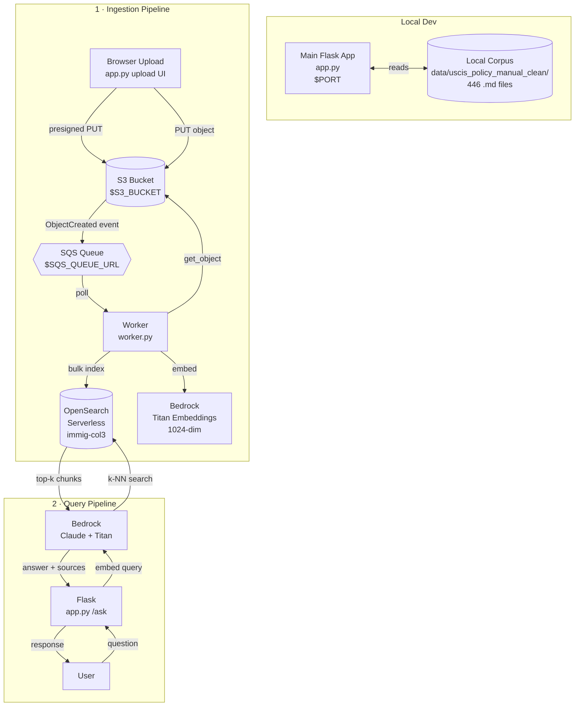

# Codebase Map — Immigration RAG Assistant

> Last reviewed against the repo: 2026-04-06

---

## System Overview

This is an **educational AWS RAG (Retrieval-Augmented Generation) project** that answers immigration policy questions using the USCIS Policy Manual as a knowledge base. The corpus (494 raw Markdown files, 446 after cleaning) was parsed from a single HTML export of the USCIS website.

The project has one main Flask app, `app.py`, which serves the KB dashboard, upload flow, and **`/ask`** (RAG via [`src/bedrock_utils.py`](../src/bedrock_utils.py): `run_ask`). Ingestion (S3 → SQS → worker → OpenSearch k-NN) runs in [`worker.py`](../worker.py).

---

## Architecture

> For the full **deployment diagram** (EC2, nginx, systemd, IAM role, AWS services with labeled edges) see [DEPLOYMENT_DIAGRAM.md](DEPLOYMENT_DIAGRAM.md).



---

## Implementation Status

| Phase | Component | Status |
|-------|-----------|--------|
| **Phase 1 — KB** | `scripts/parse_uscis.py` | ✅ Done |
| | `scripts/clean_kb.py` | ✅ Done (minor footnote regex gap) |
| | `scripts/analyze_kb.py` | ✅ Done |
| | `app.py` (dashboard + upload UI) | ✅ Done |
| **Phase 2 — Chunking** | `src/chunking.py` + `worker.py` | ✅ Done (LangChain splitters) |
| | `scripts/create_index.py` | ✅ Done |
| **Phase 3 — AWS Pipeline** | `src/s3_utils.py`, `src/opensearch_utils.py`, `src/bedrock_utils.py` | ✅ Used by `worker.py` + `app.py` `/ask` |
| | `worker.py` | ✅ Done |
| | `app.py` (`/ask` → `src/bedrock_utils.run_ask`) | ✅ RAG query path |
| | `src/bedrock_utils.py` | ✅ Titan body, `GET /_mapping` cache, Claude, `run_ask` |

---

## Current Progress

**Done**

- USCIS corpus parsed and cleaned.
- Local dashboard browsing works.
- Upload UI works through `app.py`.
- Upload flow works through presigned S3 PUT + S3 event to SQS.
- Worker runtime lives at `worker.py`.
- OpenSearch index creation works through `scripts/create_index.py`.
- [`.vscode/launch.json`](../.vscode/launch.json) exists for app and worker debugging.
- `POST /ask` returns grounded answers (Titan embed → OpenSearch k-NN → Claude).

**Not Done Yet**

- Runtime paths in `app.py` are still hardcoded instead of env-driven.
- `worker.py` still depends on `OS_HOST`, so collection recreation can still stale-break it.
- Deployment to EC2 is not ready.

**Deployment Status**

- `systemd/rag-api.service` — gunicorn + Flask (see [DEPLOYMENT_DIAGRAM.md](DEPLOYMENT_DIAGRAM.md)).
- `systemd/rag-worker@.service` — template for **three** SQS worker processes (`rag-worker@1` … `@3`); same `worker.py`, parallel queue consumers.

---

## Directory Structure

```
immigration-rag-claud-code-folder/
├── app.py                        # Main Flask app: dashboard, uploads, /health, /ask
├── worker.py                     # SQS consumer: chunk + embed + index
├── requirements.txt              # Python deps for app + worker + scripts
├── CLAUDE.md                     # Session rules + project memory for Claude Code
│
├── kb_dashboard/                 # Template assets kept under the old folder name
│   └── templates/
│       ├── base.html             # Tailwind CDN shell + nav
│       ├── index.html            # Dashboard: stats, charts, chapter explorer
│       ├── browse.html           # Two-panel file browser with live search
│       ├── upload.html           # S3 upload UI with presigned URLs
│       ├── s3_dashboard.html     # Mirrors index.html for S3 corpus
│       ├── s3_browse.html        # Mirrors browse.html for S3 corpus
│       ├── ask.html              # RAG question UI
│       └── _content_fragment.html # AJAX partial for chapter content
│
├── scripts/                      # One-time / offline tools
│   ├── parse_uscis.py            # HTML → Markdown (run once)
│   ├── clean_kb.py               # Raw → Clean corpus (run once)
│   ├── analyze_kb.py             # QA report generator
│   ├── create_index.py           # OpenSearch index creation (run once)
│   ├── check_aws.py              # S3 / SQS / OpenSearch / Bedrock connectivity check
│   ├── upload_uscis.py           # Bulk upload clean corpus to S3 (see script docstring)
│   └── smoke_test.py             # HTTP smoke: /health + POST /ask (needs running app + AWS)
│
├── src/                          # Shared AWS + chunking (imported by worker + /ask)
│   ├── __init__.py
│   ├── bedrock_utils.py          # Titan/OpenSearch spec, BEDROCK_RUNTIME, embed, Claude, run_ask
│   ├── chunking.py               # MarkdownHeader + Recursive splitters → chunk_document()
│   ├── opensearch_utils.py       # SigV4 auth; index _doc; k-NN search
│   └── s3_utils.py               # S3_CLIENT; download_object_text()
│
├── opensearch/
│   ├── index_schema.json         # k-NN index mapping + AOSS collection config
│   └── opensearch_export.py      # Optional export helper (see file)
│
├── .vscode/
│   └── launch.json               # Debug: Flask app + worker
│
├── systemd/
│   ├── rag-api.service           # gunicorn app:app on :5000
│   └── rag-worker@.service       # template: enable rag-worker@1 @2 @3 (three worker.py processes)
│
├── tests/
│   └── test_kb.py                # pytest — tests root app helpers and routes
│
├── data/
│   ├── uscis_policy_manual/      # 494 raw .md files (git-ignored)
│   └── uscis_policy_manual_clean/ # 446 clean .md files (git-ignored)
│
├── docs/
│   ├── CODEBASE_MAP.md           # This file
│   ├── sequence-diagrams.md      # Ingest, browse, /ask sequences
│   └── Instructions Second project.docx.md  # Course handout (high-level; repo uses src/)
└── reports/
    └── kb_report.md              # KB quality report (generated by analyze_kb.py)
```

---

## Module Guide

### `app.py` — The Main Flask App

**Purpose**: Corpus inspection, upload debugging, `/health`, and **RAG** at `/ask`. **`src.bedrock_utils` is imported only on `POST /ask`** (GET serves `ask.html` without loading Bedrock/OpenSearch clients).

**Key routes:**

| Route | Method | What it does |
|-------|--------|-------------|
| `/health` | GET | JSON `{"status": "ok"}` |
| `/` | GET | Dashboard: raw vs clean stats, charts, chapter explorer |
| `/browse` | GET | Two-panel tree browser (**local** `data/uscis_policy_manual_clean/`) |
| `/content/<path>` | GET | AJAX: renders one `.md` file as HTML (local corpus) |
| `/search?q=` | GET | Substring search over **in-memory** local clean files (max 100 results), not OpenSearch |
| `/ask` | GET | Ask UI (`ask.html`) |
| `/ask` | POST | JSON `{"question": "..."}` → `answer`, `answer_html`, `sources` (or `error`) |
| `/upload` | GET | Upload UI |
| `/v1/uploads/presign` | POST | Generates S3 presigned PUT URL (expires 300s) |
| `/upload/files` | GET | JSON: recent `.md` keys under `uploads/` + `uscis_policy_manual_clean/` (max 50) |
| `/s3/`, `/s3/browse`, `/s3/content/*`, `/s3/search` | GET | Same UX as local routes but data from **S3** (`ListObjectsV2` + `GetObject`); search is still in-Python substring over cached bodies |

**Key helper functions** (importable, tested):
`word_count`, `token_count`, `footnote_count`, `residual_footnote_count`, `section_count`, `is_stub`, `vol_sort_key`, `pretty_vol`, `word_bucket`, `token_bucket`

**Gotchas:**
- `RAW_ROOT` and `CLEAN_ROOT` are **hardcoded** relative paths to `data/` — must be env vars before EC2 deploy
- Entire corpus is loaded into `_cache` in memory on first request — fine locally, bad on a t2.micro
- S3 scan reads every `.md` file body inline — slow for large buckets
- Worker now expects native S3 event messages on SQS; any legacy custom queue messages should be drained before debugging

---

### `scripts/` — Data Pipeline

**Data flow:**

```
uscis_policy_manual.html
    → parse_uscis.py
    → data/uscis_policy_manual/    (494 files, 48 stubs)
    → clean_kb.py
    → data/uscis_policy_manual_clean/  (446 files)
    → src/chunking.py (via worker on ingest)
    → src/bedrock_utils.py (Titan embed)
    → src/opensearch_utils.py (index + k-NN)
```

**`parse_uscis.py`**: Depth-based BeautifulSoup traversal of USCIS HTML. Uses `markdownify` for conversion. Creates 3-level directory hierarchy (volume/part/chapter). Stub chapters get `_No content._` sentinel.

**`clean_kb.py`**: Strips `**[n]**` bold footnote refs, truncates at `## Footnotes`, removes stubs. Known gap: 4 files with bare `[n]` refs still noisy.

**`analyze_kb.py`**: Generates `reports/kb_report.md` with word/token distributions, oversized files (≥8000 words), footnote density. Reads the **raw** corpus.

**`create_index.py`**: One-time OpenSearch Serverless index creation. Reads `opensearch/index_schema.json`, resolves the live collection endpoint from AWS, and is safe to re-run (ignores `resource_already_exists_exception`).

---

### `opensearch/index_schema.json` — Index Schema

**Key document fields:**

| Field | Type | Notes |
|-------|------|-------|
| `s3_key` | keyword | S3 object key for source file |
| `category` | keyword | `"uscis"` or `"other"` |
| `volume`, `part`, `chapter` | keyword | USCIS hierarchy |
| `section_path` | keyword (see below) | Worker sends a **list** of header strings; align mapping with ingest if queries fail |
| `text` | text | Chunk content |
| `chunk_index` | (worker) | Present in documents built by [`worker.py`](../worker.py) — integer sequence per file |
| `chunk_id` | integer | Declared in [`index_schema.json`](../opensearch/index_schema.json) — **name does not match** `chunk_index` until schema + worker agree |
| `vector` | knn_vector | 1024-dim, faiss HNSW, fp16, innerproduct |

**k-NN config**: `innerproduct` space type (requires L2-normalized vectors), `ef_search: 512`, 2 shards, 0 replicas.

---

### `src/` — Shared ingestion + RAG helpers

Imported by [`worker.py`](../worker.py) (after `dotenv.load_dotenv()`) and from `app.py` on `POST /ask` (after env is set). Clients (`S3_CLIENT`, `BEDROCK_RUNTIME`, `OPENSEARCH_HTTP_AUTH`) are created at module import — **entrypoints must load `.env` before importing `src.*`**.

| File | Role |
|------|------|
| `chunking.py` | `chunk_document(text)` — `MarkdownHeaderTextSplitter` + `RecursiveCharacterTextSplitter` |
| `s3_utils.py` | `S3_CLIENT`, `download_object_text(bucket, key)` |
| `opensearch_utils.py` | `OPENSEARCH_HTTP_AUTH`, `send_doc_to_opensearch(...)`, `knn_search_top_chunks(...)` |
| `bedrock_utils.py` | `load_opensearch_vector_spec`, `embed_text_for_titan`, `invoke_claude`, `run_ask` |

---

## Conventions

- **Imports**: Always `import module` then `module.Class()` — never `from module import X`
- **Error handling**: Fail fast — no `try/except: pass`, no defensive defaults
- **Functions**: Named functions to make code top-down readable
- **argparse**: Always wrapped in `parse_args()`, same var names as dest
- **UI**: Flask + Tailwind CDN + Tabulator.js + Plotly server-side. No npm, no build steps.
- **Corpus sentinel**: `_No content._` = USCIS reserved/stub chapter

---

## Gotchas

1. **`RAW_ROOT`/`CLEAN_ROOT` hardcoded** in `app.py` — breaks on EC2
2. **`chunk_id` (schema) vs `chunk_index` (worker)** — [`opensearch/index_schema.json`](../opensearch/index_schema.json) defines `chunk_id`; [`worker.py`](../worker.py) `build_doc` sends `chunk_index`. Align field names (and types) before treating the index as authoritative
3. **`check_aws.py` and `worker.py` still trust `OS_HOST`** — unlike `create_index.py`, they are still vulnerable to stale endpoints after collection recreation
4. **`innerproduct` requires normalized vectors** — Titan embeddings use `normalize: true`; dimension comes from live `GET /_mapping` via [`src/bedrock_utils.py`](../src/bedrock_utils.py)
5. **`src/` import order** — modules read `os.environ` at import; run `dotenv.load_dotenv()` first in `worker.py` / `scripts/check_aws.py`
6. **AWS Account ID exposed** in `opensearch/index_schema.json` — IAM ARNs contain `538134613779`
7. **tiktoken ≠ Titan tokenizer** — `cl100k_base` is an approximation; exact Titan token counts may differ
8. **`analyze_kb.py` hardcodes `"48 files"`** in rendered report — will be wrong if corpus changes
9. **`systemd/` files are intentionally empty** — they must be rewritten when EC2 deployment starts

---

## Navigation Guide

**To start the Flask app locally:**
```bash
PORT=5051 python app.py
```

**To re-run the data pipeline from scratch:**
```bash
python scripts/parse_uscis.py
python scripts/clean_kb.py
python scripts/analyze_kb.py
```

**To create/recreate the OpenSearch index:**
```bash
python scripts/create_index.py
```

**Chunking:** [`src/chunking.py`](../src/chunking.py) (`MarkdownHeaderTextSplitter` + `RecursiveCharacterTextSplitter`); called from [`worker.py`](../worker.py).

**To debug the SQS worker:**
→ Run `worker.py` and make sure the queue contains only S3 `ObjectCreated` event messages
→ For **local debugging**, run a **single** `worker.py` (a stray second process + debugger both poll the same queue and confuse you). On **EC2**, three `rag-worker@N` instances are fine — SQS visibility timeout keeps one message with one consumer at a time.

**RAG query:** [`src/bedrock_utils.py`](../src/bedrock_utils.py) (`run_ask`); `POST /ask` on [`app.py`](../app.py). Claude system prompt: context-only, refuse when not confident. Ensure the index has chunks (run worker after upload).

**To deploy to EC2:**
1. Fix hardcoded paths in `app.py` → env vars
2. Fill `.env` with real AWS values
3. Copy `systemd/*.service` to `/etc/systemd/system/`, `daemon-reload`
4. `systemctl enable --now rag-api rag-worker@1 rag-worker@2 rag-worker@3`
