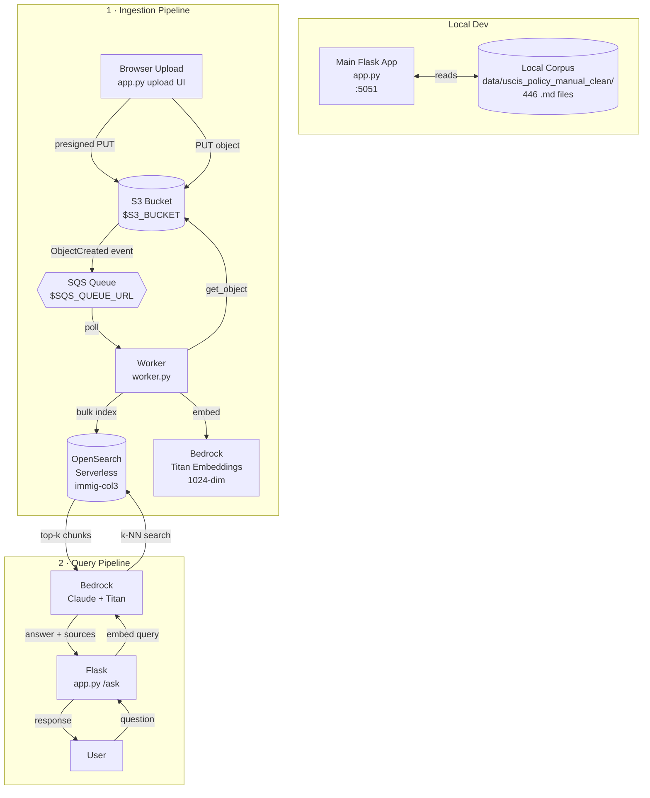

# Codebase Map — Immigration RAG Assistant

> Auto-generated by Cartographer. Last mapped: 2026-04-03

---

## System Overview

This is an **educational AWS RAG (Retrieval-Augmented Generation) project** that answers immigration policy questions using the USCIS Policy Manual as a knowledge base. The corpus (494 raw Markdown files, 446 after cleaning) was parsed from a single HTML export of the USCIS website.

The project has one main Flask app, `app.py`, which serves the KB dashboard, upload flow, and **`/ask`** (RAG via [`rag_query.py`](../rag_query.py) + [`embedding_config.py`](../embedding_config.py)). Ingestion (S3 → SQS → worker → OpenSearch k-NN) runs in [`worker.py`](../worker.py).

---

## Architecture



---

## Implementation Status

| Phase | Component | Status |
|-------|-----------|--------|
| **Phase 1 — KB** | `scripts/parse_uscis.py` | ✅ Done |
| | `scripts/clean_kb.py` | ✅ Done (minor footnote regex gap) |
| | `scripts/analyze_kb.py` | ✅ Done |
| | `app.py` (dashboard + upload UI) | ✅ Done |
| **Phase 2 — Chunking** | `worker.py` (LangChain splitters) | ✅ Done |
| | `src/chunking.py` | ⚠️ Legacy stub — not used by worker |
| | `scripts/create_index.py` | ✅ Done |
| **Phase 3 — AWS Pipeline** | `src/opensearch_utils.py` | ❌ Empty (unused) |
| | `src/s3_utils.py` | ❌ Empty (unused) |
| | `worker.py` | ✅ Done |
| | `app.py` + `rag_query.py` (`/ask`) | ✅ RAG query path |
| | `embedding_config.py` | ✅ Titan body + `GET /_mapping` dimension cache |

---

## Current Progress

**Done**

- USCIS corpus parsed and cleaned.
- Local dashboard browsing works.
- Upload UI works through `app.py`.
- Upload flow works through presigned S3 PUT + S3 event to SQS.
- Worker runtime lives at `worker.py`.
- OpenSearch index creation works through `scripts/create_index.py`.
- VS Code launch configs exist for app and worker debugging.
- `POST /ask` returns grounded answers (Titan embed → OpenSearch k-NN → Claude).

**Not Done Yet**

- `src/opensearch_utils.py`, `src/s3_utils.py`, and most of `src/bedrock_utils.py` are still unused placeholders.
- Runtime paths in `app.py` are still hardcoded instead of env-driven.
- `worker.py` still depends on `OS_HOST`, so collection recreation can still stale-break it.
- Deployment to EC2 is not ready.

**Deployment Status**

- `systemd/rag-api.service` is intentionally empty for now.
- `systemd/rag-worker.service` is intentionally empty for now.
- Both files need to be rewritten later when the real EC2 layout, command lines, and env locations are finalized.

---

## Directory Structure

```
immigration-rag-claud-code-folder/
├── app.py                        # Main Flask app: dashboard, uploads, /health, /ask
├── worker.py                     # SQS consumer: chunk + embed + index
├── embedding_config.py           # Titan JSON body; dimension from live OpenSearch _mapping
├── rag_query.py                  # POST /ask backend: embed, k-NN, Claude
├── requirements.txt              # Python deps for app + worker + scripts
├── CLAUDE.md                     # Session rules + project memory for Claude Code
│
├── kb_dashboard/                 # Template assets kept under the old folder name
│   └── templates/
│       ├── base.html             # Tailwind CDN shell + nav
│       ├── index.html            # Dashboard: stats, charts, chapter explorer
│       ├── browse.html           # Two-panel file browser with live search
│       ├── upload.html           # S3 upload UI with presigned URLs
│       ├── s3_dashboard.html     # Mirrors index.html for S3 corpus
│       ├── s3_browse.html        # Mirrors browse.html for S3 corpus
│       ├── ask.html              # RAG question UI
│       └── _content_fragment.html # AJAX partial for chapter content
│
├── scripts/                      # One-time / offline tools
│   ├── parse_uscis.py            # HTML → Markdown (run once)
│   ├── clean_kb.py               # Raw → Clean corpus (run once)
│   ├── analyze_kb.py             # QA report generator
│   ├── create_index.py           # OpenSearch index creation (run once)
│   └── smoke_test.py             # Basic HTTP smoke test
│
├── src/                          # Production modules (Phase 2-3)
│   ├── bedrock_utils.py          # Env var constants only (skeleton)
│   ├── chunking.py               # chunk_document() — raises NotImplementedError
│   ├── opensearch_utils.py       # EMPTY
│   └── s3_utils.py               # EMPTY
│
├── opensearch/
│   └── index_schema.json         # k-NN index mapping + AOSS collection config
│
├── systemd/
│   ├── rag-api.service           # Empty placeholder until EC2 deployment layout is finalized
│   └── rag-worker.service        # Empty placeholder until EC2 deployment layout is finalized
│
├── tests/
│   └── test_kb.py                # pytest — tests root app helpers and routes
│
├── data/
│   ├── uscis_policy_manual/      # 494 raw .md files (git-ignored)
│   └── uscis_policy_manual_clean/ # 446 clean .md files (git-ignored)
│
├── docs/
│   └── CODEBASE_MAP.md           # This file
└── reports/
    └── kb_report.md              # KB quality report (generated by analyze_kb.py)
```

---

## Module Guide

### `app.py` — The Main Flask App

**Purpose**: Corpus inspection, upload debugging, `/health`, and **RAG** at `/ask` (lazy-imports [`rag_query.py`](../rag_query.py)).

**Key routes:**

| Route | Method | What it does |
|-------|--------|-------------|
| `/` | GET | Dashboard: raw vs clean stats, charts, chapter explorer |
| `/browse` | GET | Two-panel tree browser |
| `/content/<path>` | GET | AJAX: renders one `.md` file as HTML |
| `/search?q=` | GET | Full-text search, returns JSON (max 100 results) |
| `/ask` | GET | Ask UI (`ask.html`) |
| `/ask` | POST | JSON `{"question": "..."}` → `answer`, `answer_html`, `sources` (or `error`) |
| `/upload` | GET | Upload UI |
| `/v1/uploads/presign` | POST | Generates S3 presigned PUT URL (expires 300s) |
| `/s3/`, `/s3/browse`, `/s3/content/*`, `/s3/search` | GET | Mirrors of local routes but reads from S3 |

**Key helper functions** (importable, tested):
`word_count`, `token_count`, `footnote_count`, `residual_footnote_count`, `section_count`, `is_stub`, `vol_sort_key`, `pretty_vol`, `word_bucket`, `token_bucket`

**Gotchas:**
- `RAW_ROOT` and `CLEAN_ROOT` are **hardcoded** relative paths to `data/` — must be env vars before EC2 deploy
- Entire corpus is loaded into `_cache` in memory on first request — fine locally, bad on a t2.micro
- S3 scan reads every `.md` file body inline — slow for large buckets
- Worker now expects native S3 event messages on SQS; any legacy custom queue messages should be drained before debugging

---

### `scripts/` — Data Pipeline

**Data flow:**

```
uscis_policy_manual.html
    → parse_uscis.py
    → data/uscis_policy_manual/    (494 files, 48 stubs)
    → clean_kb.py
    → data/uscis_policy_manual_clean/  (446 files)
    → [FUTURE] src/chunking.py
    → [FUTURE] src/bedrock_utils.py (Titan embed)
    → [FUTURE] src/opensearch_utils.py (bulk index)
```

**`parse_uscis.py`**: Depth-based BeautifulSoup traversal of USCIS HTML. Uses `markdownify` for conversion. Creates 3-level directory hierarchy (volume/part/chapter). Stub chapters get `_No content._` sentinel.

**`clean_kb.py`**: Strips `**[n]**` bold footnote refs, truncates at `## Footnotes`, removes stubs. Known gap: 4 files with bare `[n]` refs still noisy.

**`analyze_kb.py`**: Generates `reports/kb_report.md` with word/token distributions, oversized files (≥8000 words), footnote density. Reads the **raw** corpus.

**`create_index.py`**: One-time OpenSearch Serverless index creation. Reads `opensearch/index_schema.json`, resolves the live collection endpoint from AWS, and is safe to re-run (ignores `resource_already_exists_exception`).

---

### `opensearch/index_schema.json` — Index Schema

**Key document fields:**

| Field | Type | Notes |
|-------|------|-------|
| `s3_key` | keyword | S3 object key for source file |
| `category` | keyword | `"uscis"` or `"other"` |
| `volume`, `part`, `chapter` | keyword | USCIS hierarchy |
| `section_path` | keyword | From `MarkdownHeaderTextSplitter` |
| `text` | text | Chunk content |
| `vector` | knn_vector | 1024-dim, faiss HNSW, fp16, innerproduct |

**k-NN config**: `innerproduct` space type (requires L2-normalized vectors), `ef_search: 512`, 2 shards, 0 replicas.

---

### `src/` — Future Production Modules (Phase 2-3)

All **skeleton/empty stubs**. Nothing here runs yet.

| File | Intended purpose | Current state |
|------|-----------------|---------------|
| `bedrock_utils.py` | Titan embed + Claude generate wrappers | Constants only, no functions |
| `chunking.py` | `MarkdownHeaderTextSplitter` → `RecursiveCharacterTextSplitter` pipeline | Raises `NotImplementedError` |
| `opensearch_utils.py` | Bulk index + k-NN query | **Empty file** |
| `s3_utils.py` | Upload, presigned URLs, CORS config | **Empty file** |

---

## Conventions

- **Imports**: Always `import module` then `module.Class()` — never `from module import X`
- **Error handling**: Fail fast — no `try/except: pass`, no defensive defaults
- **Functions**: Named functions to make code top-down readable
- **argparse**: Always wrapped in `parse_args()`, same var names as dest
- **UI**: Flask + Tailwind CDN + Tabulator.js + Plotly server-side. No npm, no build steps.
- **Corpus sentinel**: `_No content._` = USCIS reserved/stub chapter

---

## Gotchas

1. **`RAW_ROOT`/`CLEAN_ROOT` hardcoded** in `app.py` — breaks on EC2
2. **`chunk_id` vs `chunk_index`** — OpenSearch schema uses `chunk_id`, CLAUDE.md says `chunk_index`. Inconsistency to resolve before first indexing run
3. **`check_aws.py` and `worker.py` still trust `OS_HOST`** — unlike `create_index.py`, they are still vulnerable to stale endpoints after collection recreation
4. **`innerproduct` requires normalized vectors** — Titan embeddings use `normalize: true`; dimension comes from live `GET /_mapping` via [`embedding_config.py`](../embedding_config.py)
5. **Legacy `src/` stubs** — real chunking/embed/query live in `worker.py` / `rag_query.py`, not `src/chunking.py`
6. **AWS Account ID exposed** in `opensearch/index_schema.json` — IAM ARNs contain `538134613779`
7. **tiktoken ≠ Titan tokenizer** — `cl100k_base` is an approximation; exact Titan token counts may differ
8. **`analyze_kb.py` hardcodes `"48 files"`** in rendered report — will be wrong if corpus changes
9. **`systemd/` files are intentionally empty** — they must be rewritten when EC2 deployment starts

---

## Navigation Guide

**To start the Flask app locally:**
```bash
PORT=5051 python app.py
```

**To re-run the data pipeline from scratch:**
```bash
python scripts/parse_uscis.py
python scripts/clean_kb.py
python scripts/analyze_kb.py
```

**To create/recreate the OpenSearch index:**
```bash
python scripts/create_index.py
```

**Chunking:** Implemented in [`worker.py`](../worker.py) (`MarkdownHeaderTextSplitter` + `RecursiveCharacterTextSplitter`); `src/chunking.py` is a legacy stub.

**To debug the SQS worker:**
→ Run `worker.py` and make sure the queue contains only S3 `ObjectCreated` event messages
→ Run **only one** `worker.py` process per queue (a stray background worker + the debugger will compete: one looks idle while the other processes messages)

**RAG query:** [`rag_query.py`](../rag_query.py) + [`embedding_config.py`](../embedding_config.py); `POST /ask` on [`app.py`](../app.py). Claude system prompt: context-only, refuse when not confident. Ensure the index has chunks (run worker after upload).

**To deploy to EC2:**
1. Fix hardcoded paths in `app.py` → env vars
2. Fill `.env` with real AWS values
3. Rewrite the empty `systemd/` service files for the real deployment layout
4. `systemctl enable rag-api rag-worker && systemctl start rag-api rag-worker`
