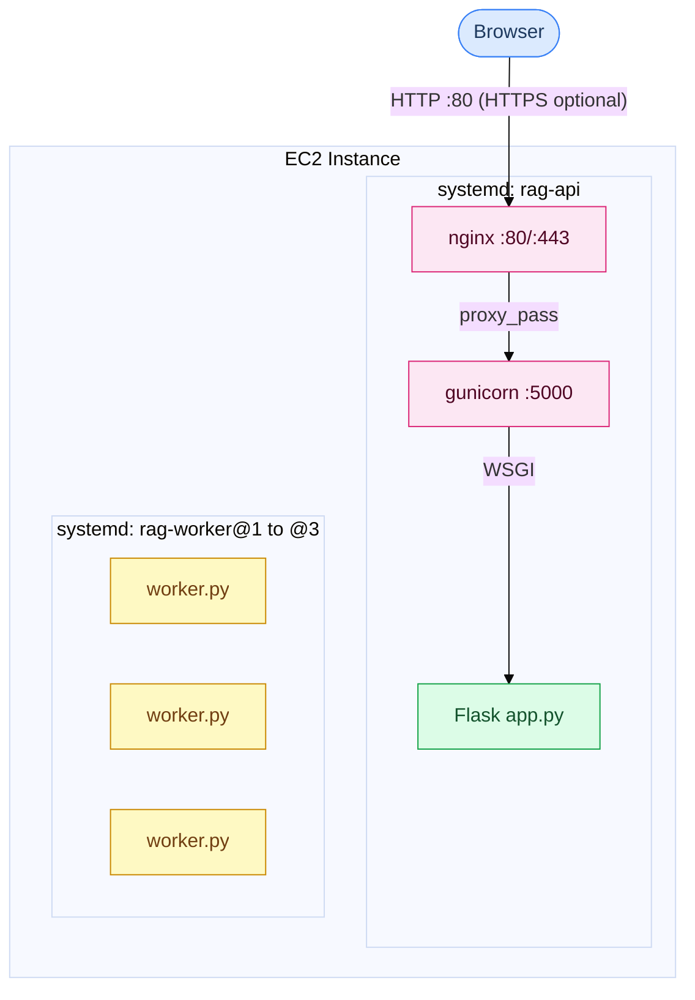
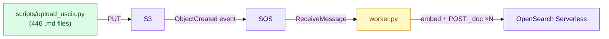

# Deployment Diagram

**What this shows:** where each process runs and which AWS APIs it calls.
For step-by-step request flows, see [sequence-diagrams.md](sequence-diagrams.md).

---

## 1 — EC2 Runtime Structure

Who runs what and how processes are wired together.



## 2 — AWS Service Calls

Which process calls which AWS API, and why.

| Process | AWS Service | Call | Purpose |
|---------|-------------|------|---------|
| Flask | S3 | `GeneratePresignedUrl` / `GetObject` | Upload UI + S3 browse |
| Flask | Bedrock Titan | `InvokeModel` | Embed the user's question |
| Flask | OpenSearch | `kNN search` | Retrieve top-k relevant chunks |
| Flask | Bedrock Claude | `InvokeModel` | Generate grounded answer |
| worker | SQS | `ReceiveMessage` / `DeleteMessage` | Poll for new file events |
| worker | S3 | `GetObject` | Download the uploaded `.md` file |
| worker | Bedrock Titan | `InvokeModel` | Embed each chunk |
| worker | OpenSearch | `POST /{index}/_doc` | One HTTP request per chunk ([`send_doc_to_opensearch`](../src/opensearch_utils.py)), not the Bulk API |
| S3 (auto) | → SQS | `ObjectCreated` event | Trigger worker after browser upload |

## 3 — Ingest Chain (one-time data load)



---

## Data Load Path (one-time)

Run from any machine with AWS creds (or the EC2 instance itself):

```
python scripts/upload_uscis.py        # 446 clean .md → S3
                                      # each PUT fires ObjectCreated → SQS
                                      # worker picks up → chunk → embed → index
```

The ingest pipeline is identical to the browser upload flow — no separate tool needed.

---

## systemd — key notes

**What it does:** starts gunicorn + worker at EC2 boot, restarts on crash, injects `.env` vars, logs via `journalctl`.

```bash
journalctl -u rag-api -f           # tail Flask/gunicorn logs
journalctl -u 'rag-worker@*' -f    # all three SQS worker instances
journalctl -u rag-worker@1 -f      # one instance only
```

**`rag-api.service` critical lines:**

| Line | Why |
|------|-----|
| `EnvironmentFile=.../.env` | All `os.environ["..."]` in app.py/src/ read from here. Missing var → KeyError crash. |
| `gunicorn app:app --bind 0.0.0.0:5000 --workers 1` | Replaces `python app.py`. **One worker process** so `app.py`’s in-memory `_s3_cache` is not split across processes (multiple workers caused inconsistent `/s3/browse`). `app:app` = the `app` object in `app.py`. |
| `Restart=always` | Auto-relaunch after crash, 5s delay. |

**`rag-worker@.service` (template — 3 instances):**

| Line | Why |
|------|-----|
| `Description=... (%i)` | `%i` is the instance id (`1`, `2`, `3`) — same unit file, three OS processes. |
| `python worker.py` | No gunicorn — each process is an infinite SQS poll loop. |
| `Restart=always` | If a process crashes, that instance relaunches so its share of the queue keeps draining. |

Enable on EC2: `sudo systemctl enable --now rag-worker@1 rag-worker@2 rag-worker@3` (after `cp` + `daemon-reload`). Three processes share one SQS queue; visibility timeout prevents the same message being processed twice at once.
