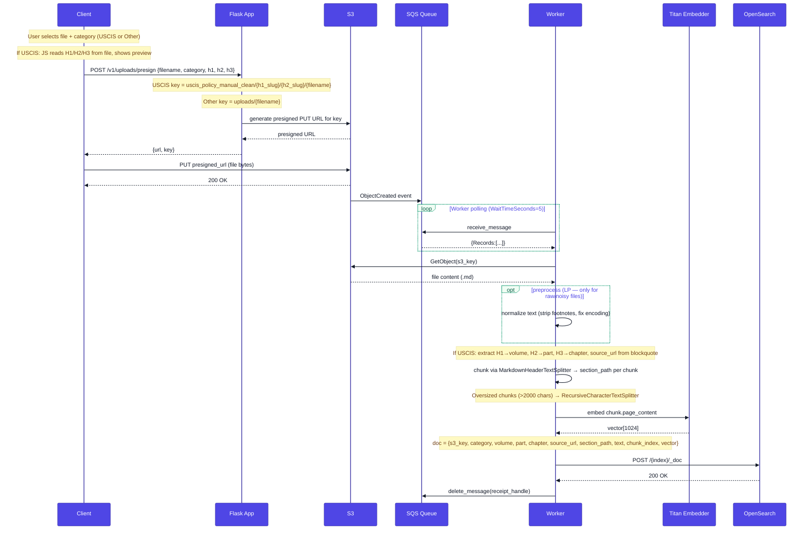
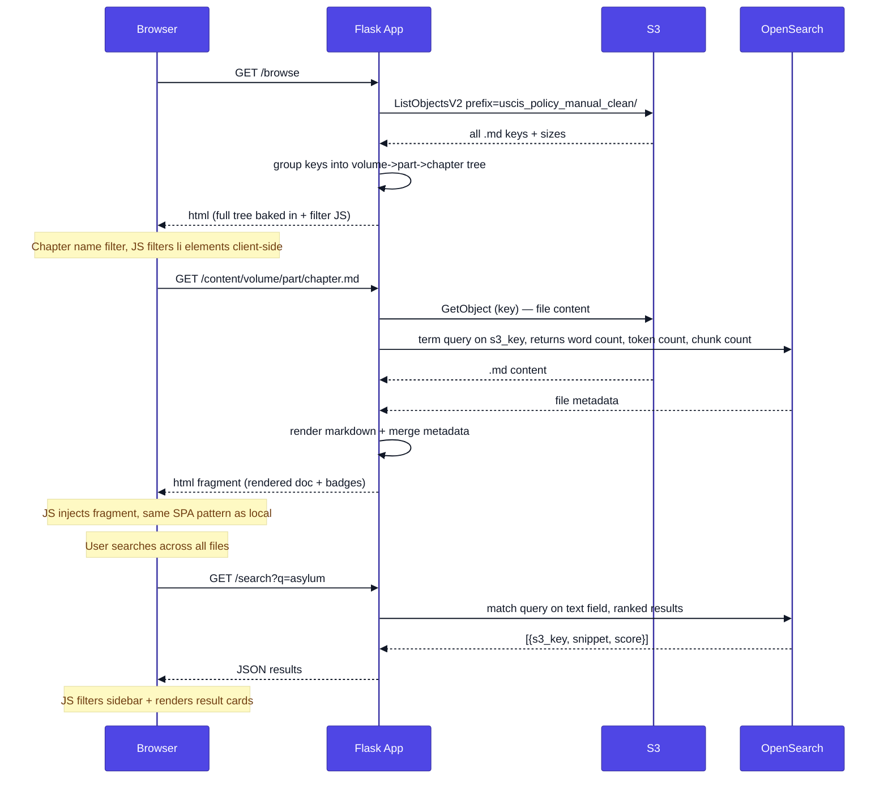
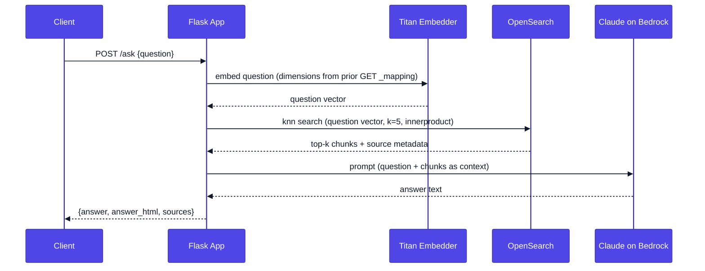

# Sequence Diagrams

## 1. Ingest (File Upload)

## 2. Dashboard Browsing — S3 Production (future)

Eager full-corpus scan is not viable against S3 (too slow, no tiktoken). Instead: the tree is built from a `ListObjectsV2` call; per-file stats (words, tokens, chunk count) come from OpenSearch metadata stored at ingest time. Chapter-name filtering stays client-side. Full-text content search goes to OpenSearch.

## 3. Ask (Question Answering)

Titan request `dimensions` comes from the live OpenSearch mapping (`load_opensearch_vector_spec` in [`src/bedrock_utils.py`](../src/bedrock_utils.py)), same as ingest — not from env. `normalize: true` stays in code.

