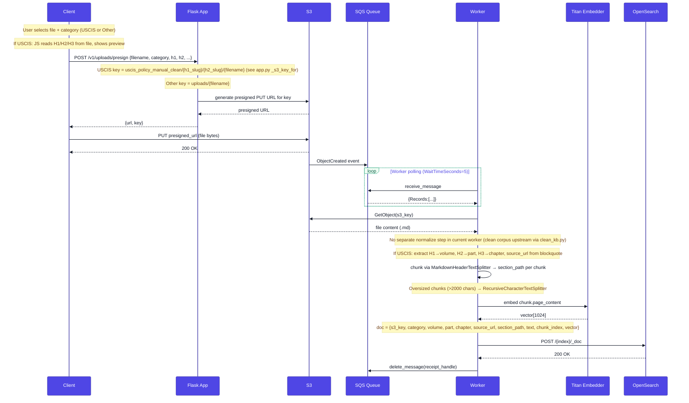
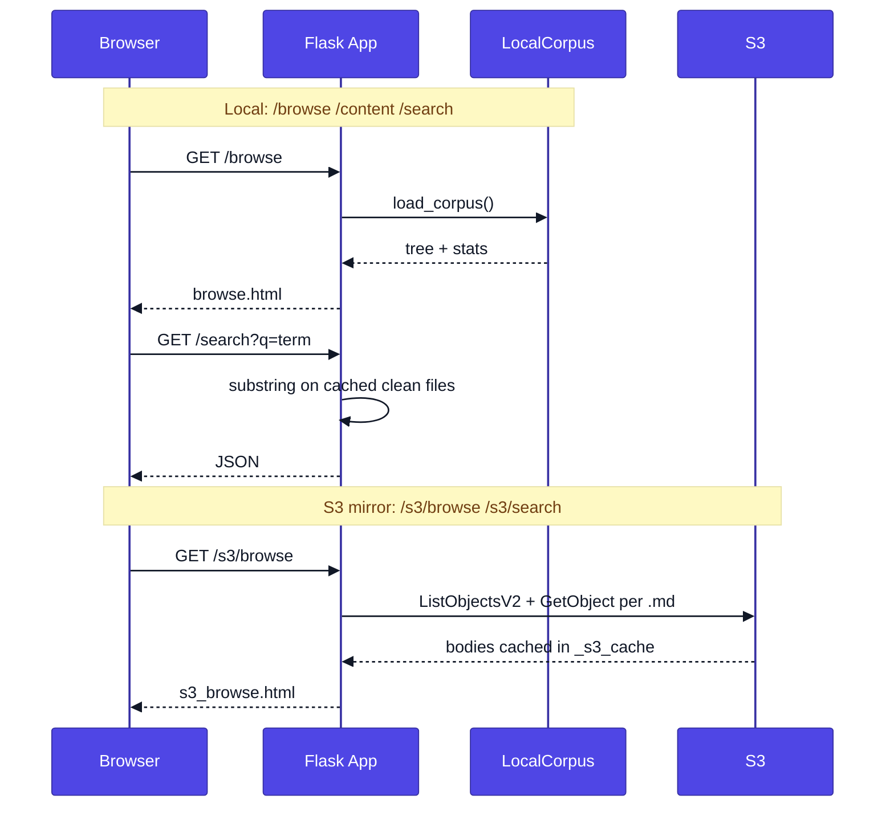
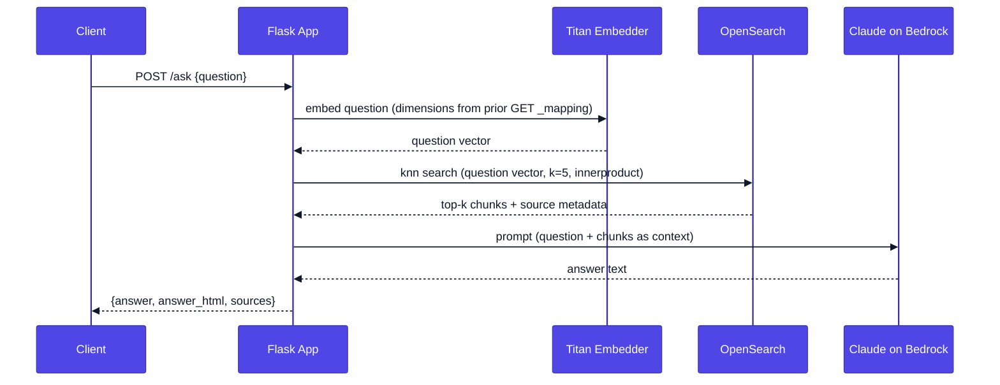

# Sequence Diagrams

## 1. Ingest (File Upload)

## 2. Dashboard browsing (two modes in `app.py`)

**Local corpus** — routes `/`, `/browse`, `/content/*`, `/search`: read [`data/uscis_policy_manual_clean/`](../data/) via `load_corpus()` (in-memory `_cache`). Search is **substring scan** in Python over loaded file text, not OpenSearch.

**S3 mirror** — routes `/s3/`, `/s3/browse`, `/s3/content/*`, `/s3/search`: `load_s3_corpus()` does `ListObjectsV2` + **`GetObject` per `.md`** into a cached DataFrame (same in-memory search as local). **No OpenSearch** on these paths today.

**Future / scale:** moving search and per-file stats to OpenSearch (or S3 Select, etc.) would avoid loading full corpus bodies into memory.

## 3. Ask (Question Answering)

Titan request `dimensions` comes from the live OpenSearch mapping (`load_opensearch_vector_spec` in [`src/bedrock_utils.py`](../src/bedrock_utils.py)), same as ingest — not from env. `normalize: true` stays in code. On **`POST /ask`**, Flask imports `src.bedrock_utils` and calls `run_ask` (Titan → k-NN `k=5` → Claude); **`GET /ask`** only renders `ask.html` (no Bedrock import).

