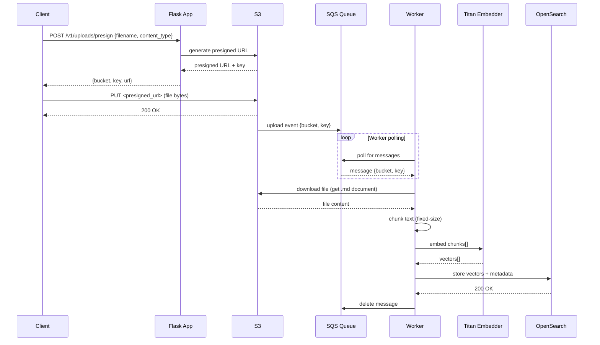
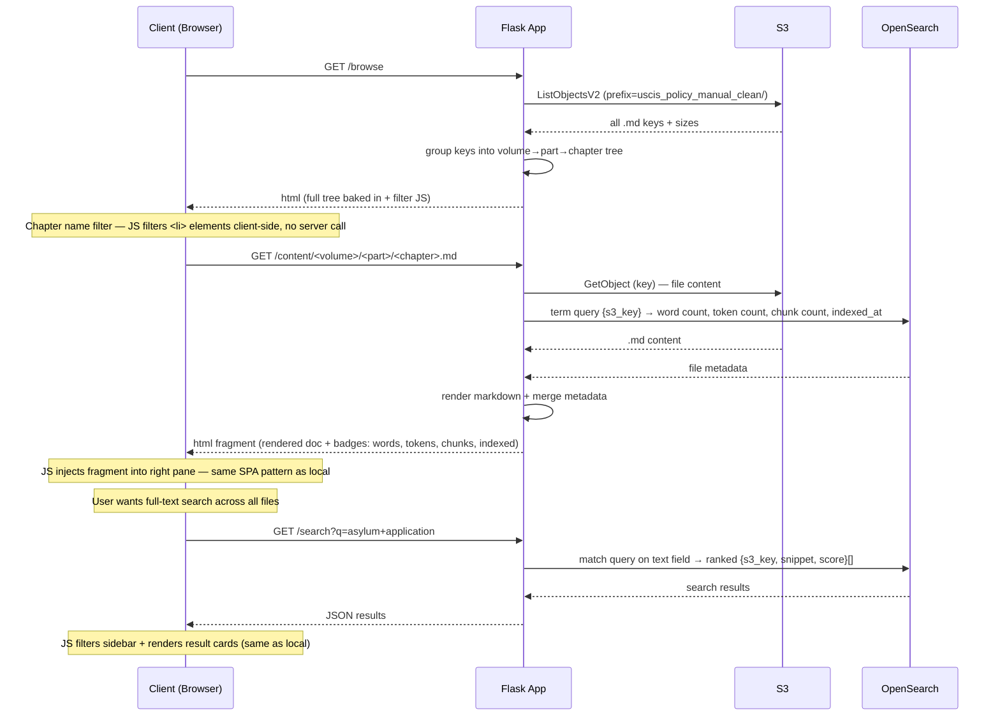
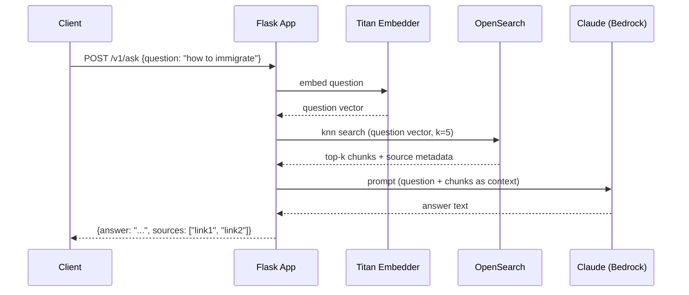

# Sequence Diagrams

## 1. Ingest (File Upload)



## 2a. Dashboard Browsing — Local SPA (current)

All files are read eagerly on first request and held in a module-level `_cache` dict for the lifetime of the Flask process. The browse page is a **single-page application**: the sidebar is permanent, and chapter content loads into the right pane via `fetch` — no page reloads. Full-text content search is also supported via a `/search` endpoint.

```mermaid
sequenceDiagram
    participant C as Client (Browser)
    participant F as Flask App
    participant Cache as _cache (process memory)
    participant D as Local Disk

    Note over F,Cache: First request only — subsequent requests skip disk entirely
    F->>D: rglob("*.md") on raw + clean roots
    D-->>F: 494 raw + 446 clean files (paths + full text)
    F->>F: compute words / tokens (tiktoken) / footnotes per file
    F->>F: build volume→part→chapter tree, Plotly charts, Tabulator JSON
    F->>Cache: store everything in _cache dict

    Note over F,Cache: All subsequent requests — cache hit, no disk I/O
    C->>F: GET /
    F->>Cache: load_corpus() hit
    Cache-->>F: chapter_rows[], charts, summary stats
    F-->>C: html (stat cards + Plotly charts + Tabulator JSON baked in)
    Note over C: Tabulator renders 446 rows; headerFilter on Part/Chapter = name filter (JS only)

    C->>F: GET /browse
    F->>Cache: load_corpus() hit
    Cache-->>F: volume→part→chapter tree
    F-->>C: html (full sidebar tree baked in — single URL, never changes)

    Note over C: User clicks a chapter in the sidebar
    C->>F: GET /content/<volume>/<part>/<chapter>.md
    F->>Cache: look up file record by path
    Cache-->>F: file record {text, words, tokens, footnotes}
    F->>F: render markdown → HTML fragment (_content_fragment.html)
    F-->>C: html fragment (breadcrumb + badges + rendered markdown)
    Note over C: JS injects fragment into right pane — sidebar unchanged, no reload

    Note over C: User types in search box (debounced 300ms)
    C->>F: GET /search?q=asylum
    F->>Cache: scan all_files[] for substring match
    Cache-->>F: [{path, volume, part, chapter, snippet}] (capped at 100)
    F-->>C: JSON results
    Note over C: JS filters sidebar to matching chapters only
    Note over C: JS renders result cards with highlighted snippets in right pane

    Note over C: User clicks a result card
    C->>F: GET /content/<path>
    F-->>C: html fragment
    Note over C: JS injects fragment — sidebar filter stays active
```

## 2b. Dashboard Browsing — S3 Production (future)

Eager full-corpus scan is not viable against S3 (too slow, no tiktoken). Instead: the tree is built from a `ListObjectsV2` call; per-file stats (words, tokens, chunk count) come from OpenSearch metadata stored at ingest time. Chapter-name filtering stays client-side. Full-text content search goes to OpenSearch.



## 3. Ask (Question Answering)


