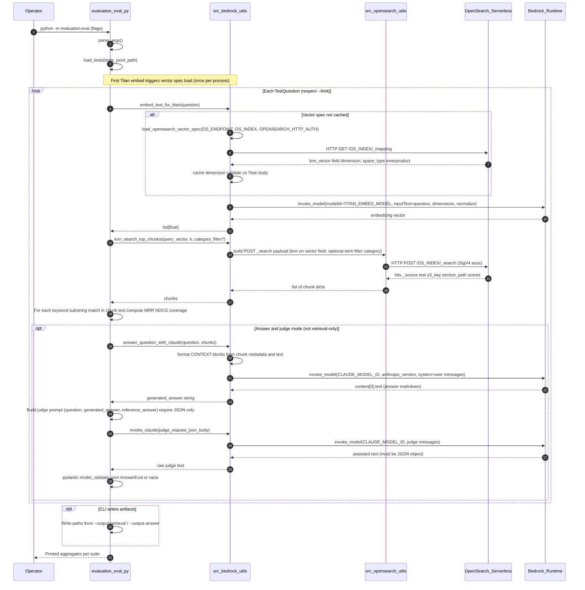

# Evaluation pipeline — sequence

Offline eval ([`eval.py`](eval.py)) uses the same AWS/OpenSearch configuration as Flask `/ask` (`AWS_REGION`, `OS_HOST`, `OS_INDEX`, `TITAN_EMBED_MODEL`, `CLAUDE_MODEL_ID`, default credential chain for Bedrock and SigV4 to OpenSearch Serverless).

**CLI modes**

- Default: run **retrieval** metrics (MRR, NDCG, keyword coverage) then **answer + judge** (Claude generates, Claude scores JSON vs `reference_answer`).
- `--retrieval-only`: skip generation and judge.
- `--answer-only`: skip the retrieval aggregate pass (each answer path still embeds + k-NN retrieves).

**Per-chunk fields** (from OpenSearch `_source`): `text`, `s3_key`, `section_path`, `source_url`, `volume`, `part`, `chapter`, `category`, `score`. Keyword metrics substring-match on `text` only. Detail JSON uses `section_path` or `s3_key` as title-like labels.

