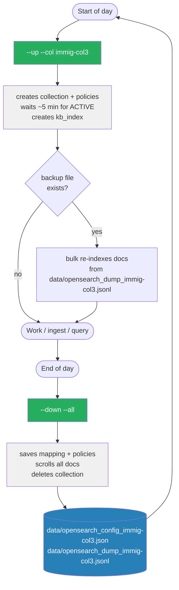

# OpenSearch Collection Lifecycle



## Commands

| Command | What it does |
|---|---|
| `python opensearch/manage.py --up --col immig-col3` | Provision collection + auto-restore if backup exists |
| `python opensearch/manage.py --down --all` | Backup all docs + delete all collections |
| `python opensearch/manage.py --backup --col immig-col3` | Backup only, no delete |
| `python opensearch/manage.py --restore --col immig-col3` | Restore docs into existing collection |

## Files

```
opensearch/
  manage.py        # this script
  lifecycle.md     # this file
  data/
    opensearch_config_<col>.json   # index mapping + policies (committed)
    opensearch_dump_<col>.jsonl    # doc backup (gitignored if large)
```
